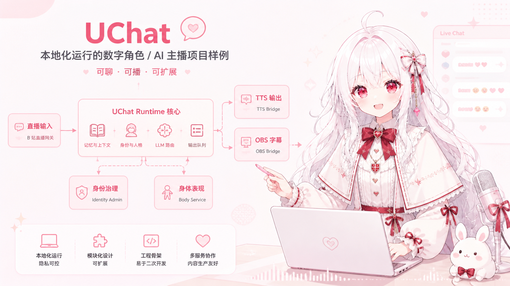

# UChat Public



<p>
  <a href="./README.md">中文</a> | <a href="./README.en.md">English</a>
</p>


UChat 是一个面向“数字角色 / AI 主播 / 可视化聊天体”的本地化运行项目样例。

这个公开版仓库保留了当前主仓库中已经成形的核心运行时、多服务边界和示例配置，但移除了私有环境参数、数据产物、模型资源与个人登录态。它的目标不是“开箱即用的商业成品”，而是提供一套可以继续二次开发、联调和替换实现的工程骨架。

## 当前仓库包含什么

- `uchat/`
  - 核心运行时、事件编排、输出调度、身份服务接入、模型路由
- `services/bilibili_gateway/`
  - B 站直播输入网关，向 runtime 提供结构化直播事件
- `services/tts_bridge/`
  - 句级 TTS 合成与播放服务，负责字幕同步和播放生命周期
- `services/obs_bridge/`
  - OBS Browser Source 实时字幕服务
- `services/body_service/`
  - 身体表现执行服务，可接 `mock` 或 `VTube Studio`
- `services/lipsync_bridge/`
  - 旁路口型同步 sidecar，把 TTS 音频镜像到 VTS 可监听设备
- `services/identity_admin/`
  - 本地身份治理入口
- `config/`
  - 主运行配置和模型路由配置
- `prompts/`
  - Prompt 模板
- `docs/`
  - 面向公开版的总览与模块文档

## 公开版默认不包含什么

为了避免隐私泄露和资源分发问题，仓库默认不包含：

- 私人 `.env`
- 私人 cookie / token / session
- 本地数据库、`debug/`、`logs/`、`data/` 产物
- TTS 模型权重、参考音频、vendor/runtime 目录
- 私人角色设定文本与私有联调资源

你需要自行准备：

- LLM API Key
- 如需真实直播输入，准备自己的 B 站登录态
- 如需真实 TTS，准备自己的 GPT-SoVITS 运行时与模型资源
- 如需真实身体表现或口型联动，准备自己的 VTube Studio / 虚拟音频设备环境

## 运行要求

- Python `3.12+`
- `uv`
- 至少一个可用的模型 API Key

推荐先执行：

```powershell
uv sync
```

## 本地准备

### 1. 创建 `.env`

仓库只保留 `.env.example`，本地请自行创建 `.env`。

至少需要：

```dotenv
DEEPSEEK_API_KEY=your_api_key_here
```

如果你需要联调真实 B 站输入，再补充：

```dotenv
BILIBILI_SESSDATA=
BILIBILI_BILI_JCT=
BILIBILI_BUVID3=
BILIBILI_DEDEUSERID=
```

### 2. 替换公开示例角色

`config/app.toml` 中的 `runtime.identity` 目前只是公开示例文本，请替换成你自己的角色设定。

不要把真实密钥、cookie 或私有配置直接写进 `config/*.toml`。

### 3. 按需检查服务配置

常见配置入口：

- `config/app.toml`
- `config/models.toml`
- `services/tts_bridge/config/service.toml`
- `services/obs_bridge/config/service.toml`
- `services/bilibili_gateway/config/service.toml`
- `services/body_service/config/service.toml`
- `services/lipsync_bridge/config/service.toml`
- `services/identity_admin/config/service.toml`

### 4. 如需真实 TTS，补齐 GPT-SoVITS 运行时与配置

公开版仓库已经移除了：

- GPT-SoVITS 整合包 / vendor runtime
- TTS 模型权重
- 参考音频
- 与你私有模型对应的配置文件内容

如果你要启用真实 TTS，至少需要自己准备并补齐：

1. 安装或放置你自己的 GPT-SoVITS 运行时
2. 准备模型配置文件，例如 `tts_infer.yaml`
3. 准备参考音频
4. 在 `services/tts_bridge/config/service.toml` 中填写正确路径

当前配置里重点需要检查的字段有：

- `[vendor].python_executable`
- `[vendor].entry_script`
- `[vendor].tts_config_path`
- `[preset].ref_audio_path`

如果这些路径仍指向公开版里不存在的示例目录，`tts_bridge` 将无法启动或无法出声。

## 最小启动方式

### 方式一：只跑核心 runtime

如果你只是想验证 prompt、模型路由和主链回复：

```powershell
uv run python -m uchat.cli
```

默认会读取：

- `config/app.toml`
- `config/models.toml`
- 本地 `.env`

如果 `config/app.toml` 中的 `runtime.scene_kind = "live_stream"`，且 `[services.platform.bilibili].url` 可用，CLI 会同时轮询 `bilibili_gateway` 事件；否则就只保留控制台输入。

### 方式二：接 OBS 字幕

终端 1：

```powershell
uv run python -m services.obs_bridge.main --serve
```

终端 2：

```powershell
uv run python -m uchat.cli
```

OBS 中添加 Browser Source：

- URL: `http://127.0.0.1:8104/overlay/`

### 方式三：接真实 TTS

终端 1：

```powershell
uv run python -m services.tts_bridge.main --serve
```

终端 2：

```powershell
uv run python -m uchat.cli
```

只有在你已经准备好 vendor/runtime 和模型资源时，这一步才有意义。否则建议先让主链退回控制台 TTS。

真实 TTS 启动前，建议按下面顺序确认：

1. GPT-SoVITS 运行时本身能独立启动。
2. `services/tts_bridge/config/service.toml` 中的 vendor 路径和模型配置路径有效。
3. `[preset].ref_audio_path` 指向真实存在的参考音频。
4. 如使用 CUDA，`[vendor].device` 与本机环境匹配。

### 方式四：接 B 站直播输入

终端 1：

```powershell
uv run python -m services.bilibili_gateway.main serve
```

终端 2：

```powershell
uv run python -m uchat.cli
```

### 方式五：接身体表现与口型旁路

身体服务：

```powershell
uv run python -m services.body_service.main --serve
```

口型旁路：

```powershell
uv run python -m services.lipsync_bridge.main --serve
```

这两项都不是 runtime 主链的硬依赖，适合在文本、字幕和 TTS 已跑通后再逐步接入。

### 方式六：启动身份治理服务

```powershell
uv run python -m services.identity_admin.main serve
```

## 推荐联调顺序

1. 先跑 `uchat.cli`，确认文本主链和模型配置可用。
2. 再跑 `obs_bridge`，确认字幕链路可连通。
3. 再接 `tts_bridge`，确认句级播放和字幕同步正常。
4. 再接 `bilibili_gateway`，确认结构化直播事件进入 runtime。
5. 最后再接 `body_service`、`lipsync_bridge` 和 `identity_admin`。

这样最容易定位问题，也能避免一开始就被多服务耦合卡住。

## 当前运行边界

- `uchat.cli` 已支持控制台输入和直播输入并行轮询
- runtime 已固定为“事件归一化 -> 记忆/上下文 -> LLM -> 句级输出 -> TTS/OBS 分发”的主链
- `tts_bridge` 是独立服务，不要求把播放逻辑塞回 runtime
- `body_service` 已是正式 sidecar，不再只是占位目录
- `lipsync_bridge` 只做旁路镜像，不反压 TTS 主链
- `identity_admin` 负责人工治理身份，不是 runtime 内部回复决策模块

## 文档入口

建议先看：

- [docs/README.md](docs/README.md)
- [English docs index](docs/en/README.md)
- [docs/project_structure_and_run.md](docs/project_structure_and_run.md)
- [docs/configuration.md](docs/configuration.md)
- [docs/runtime.md](docs/runtime.md)

如果你正在联调某个服务，再看对应模块文档和 `services/*/README.md`。

## 公开版约束

如果你继续在这个公开目录里开发，建议保持以下约束不变：

- 不提交 `.env`
- 不提交数据库和本地产物
- 不提交私有模型、音频、vendor/runtime
- 不提交私人 cookie/token/session
- 不把公开示例角色误当成正式角色配置
